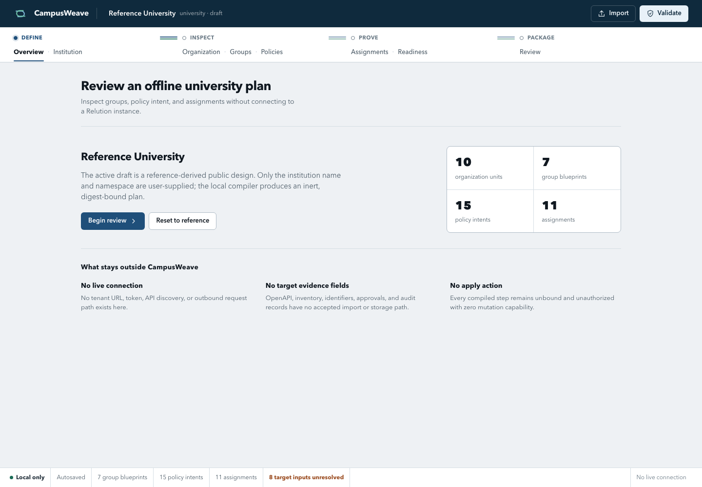

# CampusWeave

CampusWeave validates an institution-neutral university MDM profile and compiles
it into a deterministic offline plan. The repository provides a loopback web
interface, a command-line runtime, Relution OpenAPI catalog tools, schemas,
registries, and tests.

CampusWeave does not connect to a Relution instance or apply changes. A valid
profile or plan proves local consistency only.

Status: `0.1.0-alpha.1` is an unpublished source candidate. The repository has no
package release, container image, installer, public license, or configured
remote.

## Project purpose and scope

The checked-in Reference University profile describes organization units,
locations, functional cohorts, policy intent, group blueprints, assignment
intent, rollout rings, and activation gates without tenant identifiers or live
configuration.

CampusWeave supports two local workflows:

1. Review the reference profile, change its institution code and label, and
   export a validated profile or offline plan.
2. Render and validate an operation catalog from an OpenAPI document exported
   from an explicitly authorized Relution instance.

Live API work is separate from the application. It requires the exact target
contract, authorization, current-state reads, bounded scope, read-back, audit
evidence, and rollback planning described in
[`docs/relution/`](docs/relution/).

## Current capabilities

- Serve the browser interface on the fixed loopback address
  `127.0.0.1:8766`.
- Review eight profile sections: overview, institution, organization, groups,
  policies, assignments, readiness, and review.
- Change only the institution code and label of the reference profile.
- Import and validate a reference-derived profile up to 2 MiB.
- Export canonical profile JSON, a digest-bound 48-step offline plan, and
  dry-run facts.
- Validate profiles, plans, target-context metadata, registries, schemas,
  bindings, and settings-change records.
- Render Swagger 2.0 and OpenAPI 3.0, 3.1, and 3.2 documents as paired Markdown
  and JSON operation catalogs.
- Check that a rendered catalog still matches its source OpenAPI document.

## Limitations

- There is no live executor, target discovery client, inventory collector,
  approval service, deployment service, or rollback executor.
- The profile editor does not support arbitrary organization, policy, group, or
  assignment changes.
- The web service uses a fixed address and port. It has no configuration file.
- Local validation does not prove target permissions, licensing, request
  semantics, current inventory, publication state, or device outcome.
- Source checkout is the only supported distribution.
- Screenshot capture supports the Chromium, Google Chrome, and Microsoft Edge
  application paths listed in the capture script.
- Live tenant compatibility, remote CI, packaging, and publication have not been
  verified.

## Requirements and prerequisites

| Use | Requirement |
| --- | --- |
| Web interface and offline runtime | Python 3.11 or later |
| Browser interface | Current browser with JavaScript enabled |
| JavaScript tests and syntax checks | Node.js 20 or later |
| Shell helper and screenshot checks | zsh |
| Screenshot capture | Chromium, Google Chrome, or Microsoft Edge on macOS |
| Optional local quality checks | Pyright, markdownlint-cli2, and yamllint |

The application uses the Python standard library. The browser client has no
runtime package dependency.

## Installation

CampusWeave is not packaged. Use a source checkout and run commands from the
repository root. There is no `pip install`, `npm install`, or build step.

Confirm the required runtimes:

```sh
python3 --version
node --version
zsh --version
```

Node.js and zsh are required for development checks, not for the Python web
service or offline CLI.

## Configuration

The web service and offline runtime do not read application configuration from
environment variables.

| Setting | Value |
| --- | --- |
| Listener | `127.0.0.1:8766`, fixed in `campusweave/service.py` |
| Reference profile | `docs/relution/packages/university/desired-state.json` |
| Concept manifest | `docs/relution/registries/manifest.json` |
| Maximum web request body | 2 MiB |
| Concurrent request limit | 8 |
| Accepted browser persistence | Last locally validated reference-derived profile |
| Private contract workspace | `.local/relution-contract/`, ignored by Git |

The separate Relution transport helper requires an exact HTTPS
`RELUTION_API_SERVER` and an unexported `RELUTION_API_TOKEN`. Do not configure
either value for normal CampusWeave use. See
[`docs/relution/API_CONTRACT.md`](docs/relution/API_CONTRACT.md) before using the
helper.

## Usage

### Web interface

Explore the
[static CampusWeave demo](https://sebastianspicker.github.io/campusweave/).
It uses the real browser interface with a sanitized Reference University
fixture. The page labels command-capable controls as simulated and cannot
connect to a Relution instance.

Start the service:

```sh
python3 -m campusweave
```

Open <http://127.0.0.1:8766>. Stop the service with `Ctrl-C`.

The service reads the checked-in profile and manifest only. It does not inspect
token files, `.local/`, private target artifacts, or external services. The
browser stores one validated profile in local storage.



Interface behavior, routes, persistence, and export rules are documented in
[`docs/relution/CAMPUSWEAVE.md`](docs/relution/CAMPUSWEAVE.md). Frontend module
ownership is documented in [`docs/FRONTEND.md`](docs/FRONTEND.md).

### Offline runtime

Validate and inspect the checked-in profile:

```sh
python3 scripts/campusweave_runtime.py profile validate
python3 scripts/campusweave_runtime.py profile status
```

Create a reference-derived profile and its offline plan in a private temporary
directory:

```sh
campusweave_work_dir=$(mktemp -d)

python3 scripts/campusweave_runtime.py profile instantiate \
  --institution-code example-u \
  --institution-label "Example University" \
  --output "$campusweave_work_dir/example-u-profile.json"

python3 scripts/campusweave_runtime.py plan build \
  --profile "$campusweave_work_dir/example-u-profile.json" \
  --output "$campusweave_work_dir/example-u-plan.json"

python3 scripts/campusweave_runtime.py plan validate \
  --profile "$campusweave_work_dir/example-u-profile.json" \
  --plan "$campusweave_work_dir/example-u-plan.json"

python3 scripts/campusweave_runtime.py dry-run \
  --profile "$campusweave_work_dir/example-u-profile.json" \
  --plan "$campusweave_work_dir/example-u-plan.json"
```

`profile instantiate` changes only the institution code and label. `plan build`
creates a mode `0600` plan and refuses to replace an existing output. Keep plan
files and target-derived artifacts outside the repository.

See [`docs/relution/UNIVERSITY_RUNTIME.md`](docs/relution/UNIVERSITY_RUNTIME.md)
for artifact validation rules and command options.

### Relution contract catalog

Export the OpenAPI JSON through the Web API interface of the exact authorized
Relution instance. Save it under the ignored local contract directory:

```sh
mkdir -p .local/relution-contract

python3 scripts/render_relution_openapi.py \
  --spec .local/relution-contract/relution-openapi.json \
  --output .local/relution-contract/API_CATALOG.md \
  --json-output .local/relution-contract/API_CATALOG.json

python3 scripts/render_relution_openapi.py \
  --spec .local/relution-contract/relution-openapi.json \
  --output .local/relution-contract/API_CATALOG.md \
  --json-output .local/relution-contract/API_CATALOG.json \
  --check

python3 scripts/validate_machine_docs.py \
  --spec .local/relution-contract/relution-openapi.json \
  --catalog .local/relution-contract/API_CATALOG.json
```

Do not replace the fail-closed placeholders under
`docs/relution/generated/` with target-derived data.

## Repository structure

| Path | Purpose |
| --- | --- |
| `campusweave/` | Python loopback service and module entry point |
| `web/` | HTML, CSS, and JavaScript browser client |
| `scripts/campusweave_runtime.py` | Offline CLI entry point |
| `scripts/university_runtime/` | Profile, plan, target-context, and artifact logic |
| `scripts/render_relution_openapi.py` | OpenAPI catalog renderer and freshness checker |
| `scripts/validate_machine_docs.py` | Schema, registry, catalog, binding, and plan validator |
| `scripts/relution_curl.zsh` | Bounded transport helper for separately authorized API work |
| `docs/relution/` | Relution handbook, schemas, registries, templates, and reference profile |
| `docs/FRONTEND.md` | Browser architecture and frontend conventions |
| `docs/assets/screenshots/` | Synthetic screenshots captured from the reference profile |
| `tests/` | Python and Node.js tests with synthetic fixtures |
| `.github/` | CI workflow, issue forms, and pull request template |
| `pyrightconfig.json` | Python type-check scope and import paths |

## Development workflow

1. Read the source, schema, or documentation contract affected by the change.
2. Make the smallest change that preserves the offline and fail-closed
   boundaries.
3. Run the narrowest relevant tests.
4. Run the complete local gate before review.
5. Regenerate screenshots only when visible UI output changes.
6. Inspect the final diff for credentials, customer data, target evidence, and
   local tool state.

The configured GitHub Actions workflow runs on pushes, pull requests, and manual
dispatch. It uses macOS, Python 3.11, and Node.js 20. Current publication
blockers are listed in [`RELEASE_STATUS.md`](RELEASE_STATUS.md).

## Testing

Run the repository gate:

```sh
python3 -m unittest discover -s tests -v
node --test tests/test_campusweave_ui.mjs
for f in web/**/*.{js,mjs}; do
  [ -f "$f" ] || continue
  node --check "$f"
done
python3 -m py_compile scripts/render_relution_openapi.py
python3 -m py_compile scripts/validate_machine_docs.py
python3 scripts/validate_machine_docs.py
zsh -n scripts/relution_curl.zsh
zsh -n scripts/capture_campusweave_screenshots.zsh
```

Optional local checks:

```sh
pyright
markdownlint-cli2 '**/*.md'
yamllint .github
```

The CI workflow runs both test suites, the three public JavaScript entry-point
syntax checks, both Python compilation checks, machine-document validation, and
both zsh syntax checks.

## Deployment and operation

CampusWeave has no deployment configuration. Operate it directly from a source
checkout with `python3 -m campusweave`. The process listens only on loopback and
does not support a configurable host, port, reverse proxy, service manager, or
multi-user deployment.

The release procedure publishes source only and is currently blocked by the
missing license, absent Git history, absent remote, and unverified remote CI.
See [`RELEASING.md`](RELEASING.md).

## Troubleshooting

### Address already in use

Another process is listening on `127.0.0.1:8766`. Stop that process before
starting CampusWeave. The port cannot be changed.

### Profile import rejected

The imported document must be a strict JSON object derived from the checked-in
reference profile. Only institution code and label changes are accepted.
Duplicate keys, non-finite numbers, oversized input, and target-specific fields
are rejected.

### Plan permissions rejected

Plans must be regular, non-symlink files owned by the current user with mode
`0600` unless the explicitly unsafe `--allow-nonprivate` local inspection option
is used.

```sh
chmod 600 /path/to/example-u-plan.json
```

### Catalog reports `not_generated`

The checked-in catalog is intentionally empty. Render a catalog from the exact
target OpenAPI export under `.local/relution-contract/`, then validate the
source and catalog together.

### Screenshot capture cannot find a browser

Install one of the macOS Chromium-family applications listed in
`scripts/capture_campusweave_screenshots.zsh`. The script does not search
arbitrary browser paths.

## Security considerations

- Never commit credentials, customer OpenAPI documents, tenant identifiers,
  inventory, request or response captures, audit exports, or live configuration.
- Do not put a Relution token in a URL, command argument, config file, log,
  screenshot, or repository artifact.
- Keep target contracts, catalogs, bindings, and evidence under an approved
  private path with the permissions required by the runtime.
- Treat a timeout during a mutation as an unknown outcome. Read current state
  and audit evidence before deciding whether another request is safe.
- A local validation result never authorizes access to a tenant or a live
  change.

Report vulnerabilities according to [`SECURITY.md`](SECURITY.md).

## Contribution guidance

Use [`CONTRIBUTING.md`](CONTRIBUTING.md) for review requirements and the complete
public-data boundary. Use [`SUPPORT.md`](SUPPORT.md) for non-sensitive usage
questions.

CampusWeave is independent software and is not affiliated with or endorsed by
Relution GmbH.

## License

No license has been selected. Publication and redistribution remain blocked
until a license and any required third-party attribution are added.
